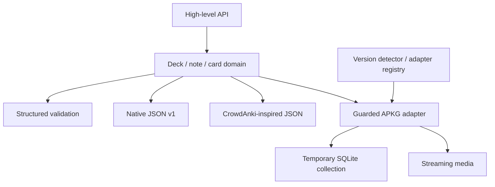

# Architecture

The domain model has no SQLite dependency in its public surface. Validation operates on the domain. Native and CrowdAnki-inspired serializers map independently. Package adapters translate through a temporary collection database. Compatibility selection is isolated behind `IAnkiVersionAdapter`.

See `docs/adr` for decisions and their tradeoffs.

