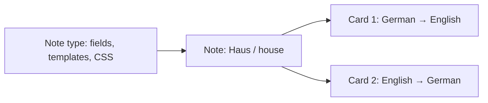

# Beginner guide to Anki's data model

## Collection

A collection is the database containing decks, notes, cards, note types, scheduler state, review history, configuration, and media references. Media payloads live beside the database. A collection is a user database, not merely one deck file.

## Deck

A deck organizes **cards** for study. It does not normally contain independent copies of notes. Nested names use `::`:

```text
Languages
Languages::German
Languages::German::Verbs
```

## Note and card

A note stores information entered by a user. A vocabulary note might have `Front = Haus`, `Back = house`, and `Example = Das Haus ist groß.` A card is a study prompt generated from that note through a template. One note can generate German → English and English → German cards.



## Note type, fields, and templates

A note type defines ordered fields, shared CSS, and card templates. Common types are Basic, Basic and reversed, and Cloze. Fields are named values such as Front, Back, Text, Extra, Pronunciation, or Image. Field order is stored and therefore significant.

A card template determines front and back HTML. `{{Front}}` inserts a field, `{{FrontSide}}` repeats the rendered question, and `{{#Image}}...{{/Image}}` conditionally renders content. Multiple templates create multiple cards.

## Cloze deletion

Cloze notes generate cards from marked spans:

```text
The capital of Germany is {{c1::Berlin}}.
```

Each distinct positive cloze index normally generates a card.

## Tags

Tags belong to notes. They support organization, search, and filtered study. Moving a card between decks does not copy or move its note tags.

## Media and LaTeX

Fields reference media by filename, for example `` or `[sound:house.mp3]`. Images, audio, and video are payload files in the collection media directory or package. LaTeX markup is stored in field/template text; rendering requires Anki's external toolchain and is outside AnkiIO.

## Scheduling

Scheduling belongs primarily to cards. Common phases are New, Learning, Review, and Relearning. A card may instead be suspended or buried. Due values have different units by queue: a new-card position, a timestamp for intraday learning, or a collection-relative day for review. Interval, ease factor, lapses, repetitions, queue, and type must agree. AnkiIO validates explicit state and otherwise creates safe new cards; it never invents mature review history.

Review log rows record historical answers. They relate to current state but are not the state itself.

## Deck options

Deck configuration controls learning steps, graduating/easy/maximum intervals, daily new/review limits, lapse behavior, and scheduler settings. A deck references a preset; several decks can share one preset.

## Stable identifiers

Deck IDs, note IDs, card IDs, note-type IDs, and note GUIDs have different jobs. Numeric IDs connect collection rows. A note GUID lets package re-import recognize a previously imported note. Preserving identity prevents duplicates and preserves scheduling relationships.

## Import/export choices

- Native AnkiIO JSON preserves every supported domain field and unknown deck JSON properties.
- CrowdAnki-inspired JSON prioritizes readable hierarchy/source control, but does not preserve scheduling.
- APKG bundles a collection database and media for deck import.
- A collection database is a live user database and must never be edited in place by this library.
- Media folders hold payloads referenced by fields and templates.

